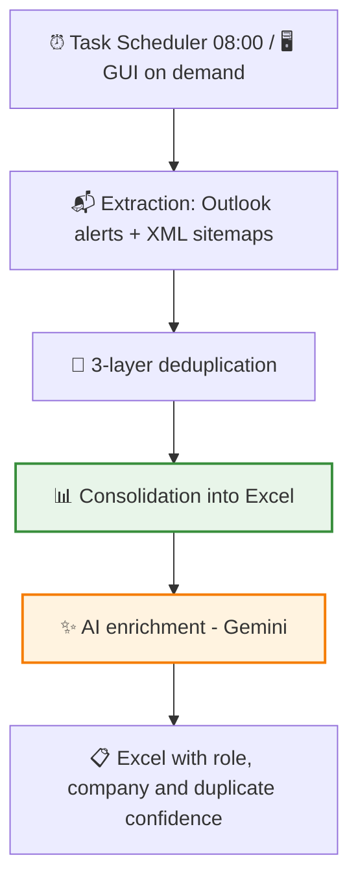

# 🧲 Showcase: Offer Subscriber — Job offer ETL with AI enrichment

This project is an ETL that consolidates every morning, with no manual intervention, all the relevant job offers into a single clean Excel file. It collects the email alerts from the job boards (Indeed, InfoJobs) and their web listings, removes duplicate offers and adds an AI layer that classifies every offer by role type, infers the company and detects duplicates across different portals.

> [!NOTE]
> **Confidentiality Notice**
> As this is a project developed for a company, certain internal details, specific prompts and parts of the code are protected by confidentiality. However, in this document I explain in broad terms the main structure and how the application works.

## 🔎 What does the application do?

Keeping track of the job market means going through dozens of email alerts every day, plus the web portals — with the same offers repeated everywhere. This application automates it from end to end:

- It runs on its own every day at 08:00 (it schedules itself in Windows on installation).
- It reads the mailbox alerts with Microsoft's official authorisation (OAuth2, **read-only** permission: it never asks for the password) and also queries the portals' sitemaps.
- It detects and discards repeated offers, even when they arrive through different channels or are republished with minor changes.
- It leaves a single, tidy Excel file, and an AI layer enriches it: role type, company and possible duplicates across portals. **The AI suggests; the person decides.**

## 🔄 Workflow

An important design detail: ETL and enrichment are **independent** modules. By the time the AI starts, the Excel file is already saved — a failure or an unexpected API cost can never compromise the collected data. The enrichment is also idempotent: it does not pay tokens again for rows already processed.

## 🧹 Layered deduplication

Each layer tackles a different type of duplicate, from the cheapest to the most expensive:

1. **Deterministic**: canonical URL + content hash. The same offer arriving twice through the same channel is discarded at zero computational cost.
2. **Fuzzy**: string similarity with **RapidFuzz** (Levenshtein-type distance), which catches republications with minor title changes that the exact layer cannot see.
3. **Cross-portal with AI**: the same offer on Indeed and on InfoJobs has different URLs — invisible to the previous layers. The AI compares a recent window of offers and writes a **confidence percentage** along with the suspected original offer. **It flags, it never deletes**: the final decision is human.

## 🏗️ Project Architecture

I developed this project applying the **Hexagonal Architecture** pattern (Ports and Adapters) — and not as a label: the core does not import a single line of O365, openpyxl or google-genai.

1. 🧠 **Domain (`core/domain`)**: the business entities (the offer, the filter configuration), value objects (canonical URL, identifier, content hash) and rules. Pure Python, without a single external dependency.
2. ⚙️ **Application (`core/application`)**: the use cases (process offers, deduplicate, enrich with AI) orchestrate the domain through ports. The core declares **what** it needs; it never knows **how** it is implemented.
3. 🔌 **Infrastructure**: the real adapters — Outlook via Microsoft Graph with per-sender parsers, sitemaps with requests + lxml, Excel storage with openpyxl and the Gemini client. Swapping Gemini for another provider, or Excel for SQLite, means writing a new adapter: the core and its tests stay untouched.

## ✨ Technical Highlights

*   🔐 **OAuth2 with minimum scope**: mailbox access via Microsoft Graph with user consent and read-only permission (`Mail.Read`), token cached locally. No shared passwords and no legacy protocols: auditable and revocable access.
*   🚫 **Zero trust in the LLM**: the role classification is validated against a closed list defined by the user (or falls back to "Unclassified"); if the company cannot be inferred, the field stays empty — **the AI never makes things up**. Nothing the model says is written without passing a deterministic filter.
*   🛡️ **Deterministic denylist on top of the AI**: with real data, the model confused the portal's name (Adecco, Randstad) with the company's name when the offer came from a staffing agency. Instead of chasing that case with prompt tweaks, I added a validation outside the LLM: no AI decides on its own about a business-sensitive field.
*   📦 **Configurable batch processing**: with the real production backlog, a single call exhausted the API timeout (504 errors). The adapter splits the classification into batches of configurable size, with no code changes if the volume shifts again.
*   🤖 **The app installs its own automation**: on execution it self-registers in the Windows Task Scheduler. Automation is part of the product, not a manual step in an installation document that someone will forget.
*   🧪 **Engineering quality**: **161 tests** (unit + integration with dedicated fixtures), **`mypy --strict` at 0 errors** in the production code and modelling with **Pydantic v2** — malformed data fails at the system's border, not halfway through the pipeline.

## 🚀 Project Status

The project is **in production**, with the AI roadmap completed (7/7 phases) and validated with real data in the packaged `.exe`. It is the most technically ambitious project in the portfolio and the one that sets the quality standard: real hexagonal architecture, a broad test suite and strict typing. The enrichment is available as a manual action from the GUI and chained automatically after every ETL run through configuration.

---

**Iván Herrero - AI & Automation Specialist**
