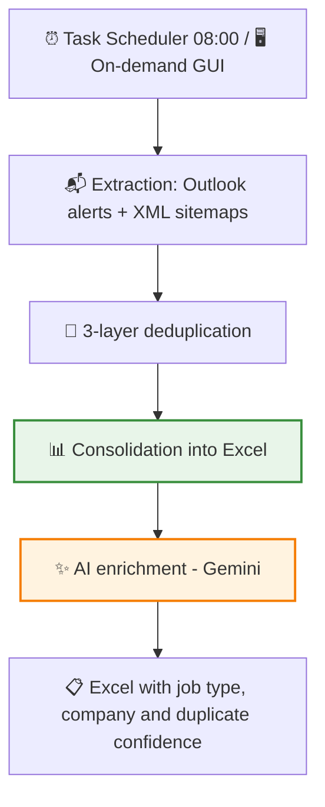
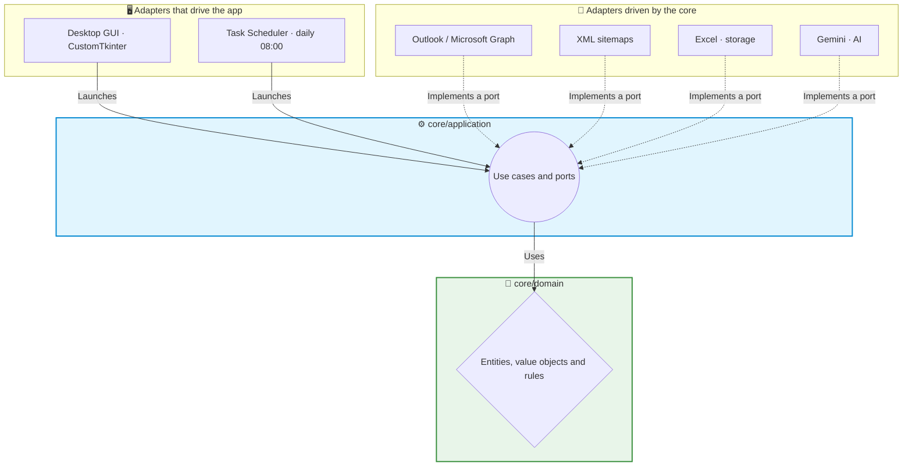

# 🧲 Showcase: Offer Subscriber — Job offer ETL with AI enrichment

This project is an ETL that every morning, with no manual intervention, consolidates all relevant job offers into a single clean Excel file. It collects the email alerts from job portals (Indeed, InfoJobs) and their web listings, removes duplicate offers and adds an AI layer that classifies each offer by job type, infers the company and detects duplicates across different portals.

> [!NOTE]
> **Confidentiality Notice**
> Since this project was developed for a company, certain internal details, specific prompts and parts of the code are protected by confidentiality. However, in this document I explain in broad terms the main structure and how the application works.

## 🔎 What does the application do?

Keeping track of the job market means going through dozens of email alerts every day, plus the web portals — with the same offers repeated everywhere. This application automates it from start to finish:

- It runs on its own every day at 08:00 (it schedules itself in Windows when installed).
- It reads the alerts from the mailbox with Microsoft's official authorization (OAuth2, **read-only** permission: it never asks for the password) and also queries the portals' sitemaps.
- It detects and discards repeated offers, even when they arrive through different channels or are republished with small changes.
- It produces a single, well-organized Excel file, and an AI layer enriches it: job type, company and possible cross-portal duplicates. **The AI suggests; the person decides.**

## 🔄 Workflow

An important design detail: ETL and enrichment are **independent** modules. When the AI starts, the Excel file is already saved — a failure or an unexpected API cost never compromises the collected data. In addition, enrichment is idempotent: it does not pay for tokens again on rows that have already been processed.

## 🧹 Layered deduplication

Each layer tackles a different type of duplicate, from the cheapest to the most expensive:

1. **Deterministic**: each offer's identifier is the hash of its canonical URL (normalized and validated with Pydantic), and each one also stores a hash of its content. If an offer arrives with an ID and a hash that already exist, it is discarded at zero computational cost.
2. **Fuzzy**: if the ID already exists but the hash has changed (the portal has edited the offer), **RapidFuzz** compares the new description with the stored one. Above a configurable threshold (90% by default) the change is considered minor and ignored; below it, it is a significant change and gets recorded. This way a corrected comma does not generate noise, but a rewritten offer does show up.
3. **Cross-portal with AI**: the same offer on Indeed and on InfoJobs has different URLs — invisible to the previous layers. The AI compares a recent window of offers and writes a **confidence percentage** and the suspected original offer. **It flags, it never deletes**: the final decision is human.

## 🏗️ Project Architecture

I developed this project applying the **Hexagonal Architecture** pattern (Ports and Adapters) — and not as a label: the core does not import a single line of O365, openpyxl or google-genai.

1. 🧠 **Domain (`core/domain`)**: the business entities (the offer, the filter configuration), value objects (canonical URL, identifier, content hash) and rules. Pure Python, without a single external dependency.
2. ⚙️ **Application (`core/application`)**: the use cases (process offers, deduplicate, enrich with AI) orchestrate the domain through ports. The core declares **what** it needs; it never knows **how** it is implemented.
3. 🔌 **Infrastructure**: the real adapters — Outlook via Microsoft Graph with per-sender parsers, sitemaps with requests + lxml, Excel storage with openpyxl and the Gemini client. Replacing Gemini with another provider, or Excel with SQLite, means writing a new adapter: the core and its tests are left untouched.

## ✨ Key Technical Features

*   🔐 **OAuth2 with minimal scope**: mailbox access via Microsoft Graph with user consent and read-only permission (`Mail.Read`), with the token cached locally. No shared passwords or legacy protocols: auditable and revocable access.
*   🚫 **Zero trust in the LLM**: the job classification is validated against a closed list defined by the user (or falls back to "Unclassified"); if the company cannot be inferred, the field is left empty — **the AI never makes things up**. Nothing the model says is written without passing a deterministic filter.
*   🛡️ **Deterministic denylist on top of the AI**: with real data, the model confused the name of the portal (Adecco, Randstad) with that of the company when the offer came from a temp agency. Instead of chasing the case through the prompt, I added a validation outside the LLM: no AI decides on its own about business-sensitive data.
*   📦 **Configurable batch processing**: with the real production backlog, a single call exhausted the API timeout (504 errors). The adapter splits the classification into batches of configurable size, without touching code if the volume changes again.
*   🤖 **The app installs its own automation**: when it runs, it registers itself in the Windows Task Scheduler. Automation is part of the product, not a manual step in an installation document that someone will forget.
*   🧪 **Engineering quality**: **161 tests** (unit + integration with dedicated fixtures), **`mypy --strict` at 0 errors** in the production code and modeling with **Pydantic v2** — malformed data fails at the system boundary, not in the middle of the pipeline.

## 🚀 Project Status

The project is **in production**, with the AI roadmap completed (7/7 phases) and validated with real data in the packaged `.exe`. It is the most technically ambitious project in the portfolio and the one that sets the quality standard: real hexagonal architecture, an extensive test suite and strict typing. Enrichment is available as a manual action from the GUI and chained automatically after each ETL run through configuration.

---

**Iván Herrero - AI & Automation Specialist**
