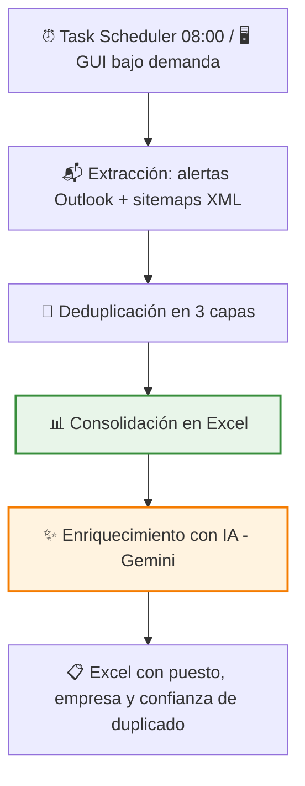
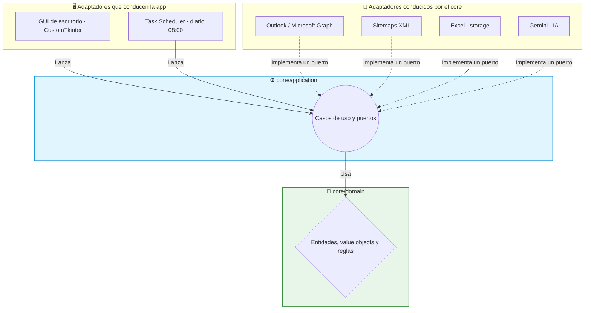

# 🧲 Showcase: Offer Subscriber — ETL de ofertas de empleo con enriquecimiento IA

Este proyecto es un ETL que consolida cada mañana, sin intervención manual, todas las ofertas de empleo relevantes en un único Excel limpio. Recoge las alertas de correo de los portales (Indeed, InfoJobs) y sus listados web, elimina las ofertas duplicadas y añade una capa de IA que clasifica cada oferta por tipo de puesto, deduce la empresa y detecta duplicados entre portales distintos.

> [!NOTE]
> **Aviso de Confidencialidad**
> Como es un proyecto desarrollado para una empresa, ciertos detalles internos, prompts específicos y partes del código están protegidos por confidencialidad. Sin embargo, en este documento explico a grandes rasgos la estructura principal y cómo funciona la aplicación.

## 🔎 ¿Qué hace la aplicación?

Seguir el mercado laboral significa revisar cada día decenas de alertas de correo, más los portales web — con las mismas ofertas repetidas por todas partes. Esta aplicación lo automatiza de principio a fin:

- Se ejecuta sola cada día a las 08:00 (ella misma se programa en Windows al instalarse).
- Lee las alertas del buzón con la autorización oficial de Microsoft (OAuth2, permiso de **solo lectura**: nunca pide la contraseña) y consulta además los sitemaps de los portales.
- Detecta y descarta las ofertas repetidas, aunque lleguen por vías distintas o se republiquen con pequeños cambios.
- Deja un único Excel ordenado, y una capa de IA lo enriquece: tipo de puesto, empresa y posibles duplicados entre portales. **La IA sugiere; la persona decide.**

## 🔄 Flujo de trabajo

Un detalle de diseño importante: ETL y enriquecimiento son módulos **independientes**. Cuando arranca la IA, el Excel ya está guardado — un fallo o un coste inesperado de la API jamás compromete los datos recogidos. Además el enriquecimiento es idempotente: no re-paga tokens por filas ya procesadas.

## 🧹 Deduplicación en capas

Cada capa ataca un tipo de duplicado distinto, de la más barata a la más cara:

1. **Determinista**: URL canónica + hash del contenido. La misma oferta llegada dos veces por la misma vía se descarta a coste computacional cero.
2. **Difusa**: similitud de cadenas con **RapidFuzz** (distancia tipo Levenshtein), que caza republicaciones con cambios menores en el título que la capa exacta no puede ver.
3. **Cross-portal con IA**: la misma oferta en Indeed y en InfoJobs tiene URLs distintas — invisible para las capas anteriores. La IA compara una ventana reciente de ofertas y escribe un **porcentaje de confianza** y la oferta original sospechada. **Marca, nunca borra**: la decisión final es humana.

## 🏗️ Arquitectura del Proyecto

He desarrollado este proyecto aplicando el patrón de **Arquitectura Hexagonal** (Puertos y Adaptadores) — y no como etiqueta: el núcleo no importa ni una línea de O365, openpyxl o google-genai.

1. 🧠 **Dominio (`core/domain`)**: las entidades del negocio (la oferta, la configuración de filtros), value objects (URL canónica, identificador, hash de contenido) y reglas. Python puro, sin una sola dependencia externa.
2. ⚙️ **Aplicación (`core/application`)**: los casos de uso (procesar ofertas, deduplicar, enriquecer con IA) orquestan el dominio a través de puertos. El core declara **qué** necesita; nunca sabe **cómo** se implementa.
3. 🔌 **Infraestructura**: los adaptadores reales — Outlook vía Microsoft Graph con parsers por remitente, sitemaps con requests + lxml, storage en Excel con openpyxl y el cliente de Gemini. Cambiar Gemini por otro proveedor, o Excel por SQLite, es escribir un adaptador nuevo: el núcleo y sus tests no se tocan.

## ✨ Características Técnicas Destacadas

*   🔐 **OAuth2 con scope mínimo**: acceso al buzón vía Microsoft Graph con consentimiento del usuario y permiso de solo lectura (`Mail.Read`), token cacheado localmente. Ni contraseñas compartidas ni protocolos legacy: acceso auditable y revocable.
*   🚫 **Confianza cero en el LLM**: la clasificación de puesto se valida contra una lista cerrada definida por el usuario (o cae a "Sin clasificar"); si la empresa no es deducible, el campo queda vacío — **la IA nunca inventa**. Nada de lo que diga el modelo se escribe sin pasar un filtro determinista.
*   🛡️ **Denylist determinista sobre la IA**: con datos reales, el modelo confundía el nombre del portal (Adecco, Randstad) con el de la empresa cuando la oferta venía de una ETT. En vez de perseguir el caso a base de prompt, añadí una validación fuera del LLM: ninguna IA decide sola sobre un dato sensible para el negocio.
*   📦 **Procesamiento en lotes configurable**: con el backlog real de producción, una sola llamada agotaba el timeout de la API (errores 504). El adaptador trocea la clasificación en lotes de tamaño configurable, sin tocar código si el volumen vuelve a cambiar.
*   🤖 **La app instala su propia automatización**: al ejecutarse se autoregistra en el Programador de tareas de Windows. La automatización es parte del producto, no un paso manual de un documento de instalación que alguien olvidará.
*   🧪 **Calidad de ingeniería**: **161 tests** (unitarios + integración con fixtures dedicadas), **`mypy --strict` a 0 errores** en el código de producción y modelado con **Pydantic v2** — los datos malformados fallan en la frontera del sistema, no en mitad del pipeline.

## 🚀 Estado del Proyecto

El proyecto está **en producción**, con el roadmap de IA completado (7/7 fases) y validado con datos reales en el `.exe` empaquetado. Es el proyecto técnicamente más ambicioso del portfolio y el que marca el estándar de calidad: arquitectura hexagonal real, suite amplia de tests y tipado estricto. El enriquecimiento está disponible como acción manual desde la GUI y encadenado automáticamente tras cada ETL mediante configuración.

---

**Iván Herrero - AI & Automation Specialist**